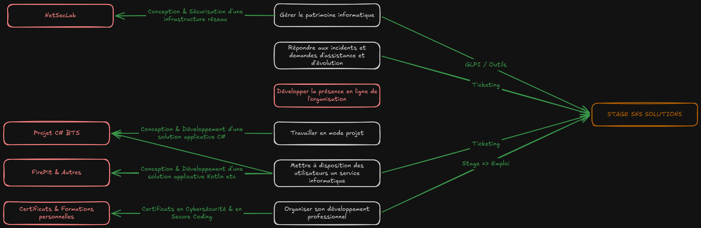
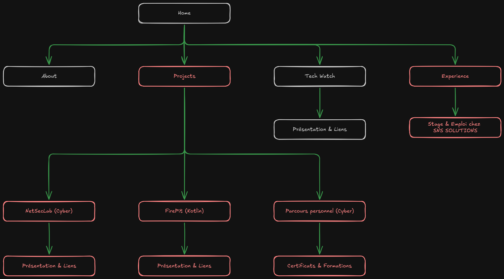

# 🗺️ Schématisation / Visualisation

> **Objectif :** visualiser le développement du portfolio et réfléchir aux maillons faibles et/ ou à renforcer et ajouter.

## Réflexion sur les compétences et les projets

## Structuration du Portfolio

